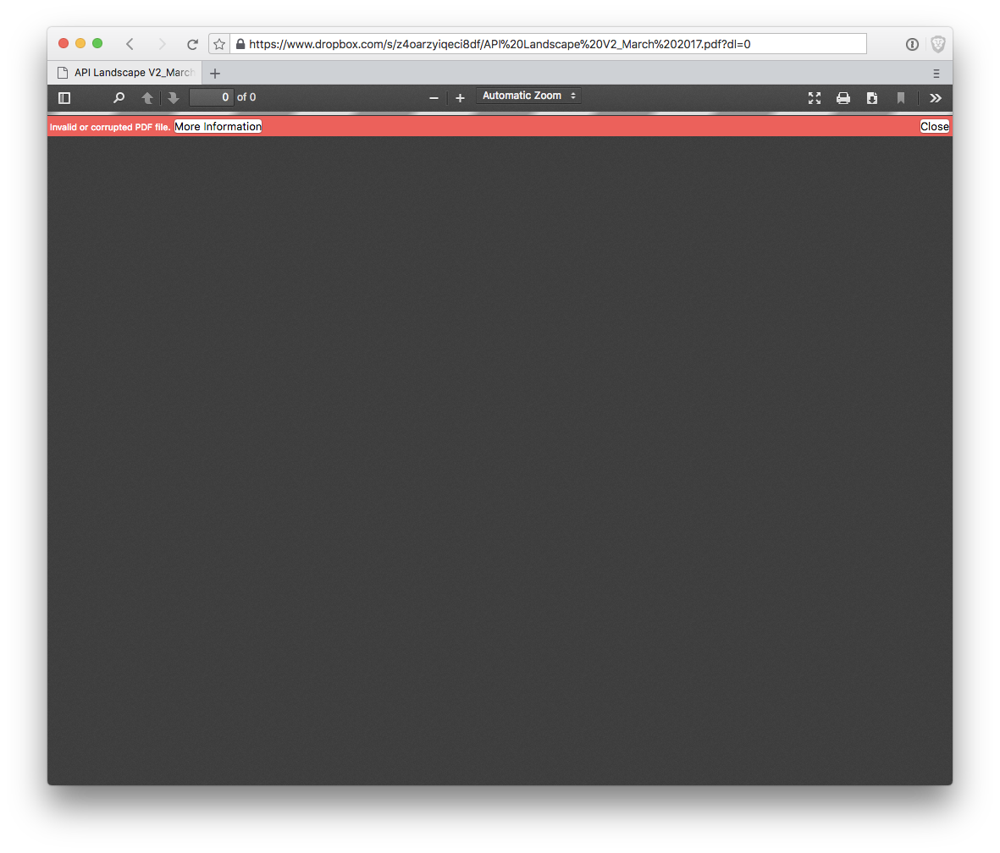
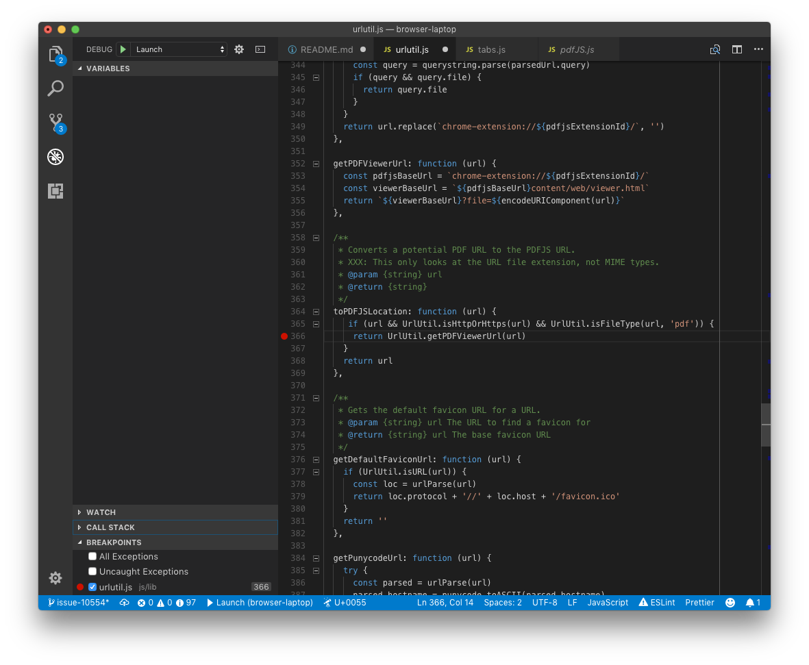
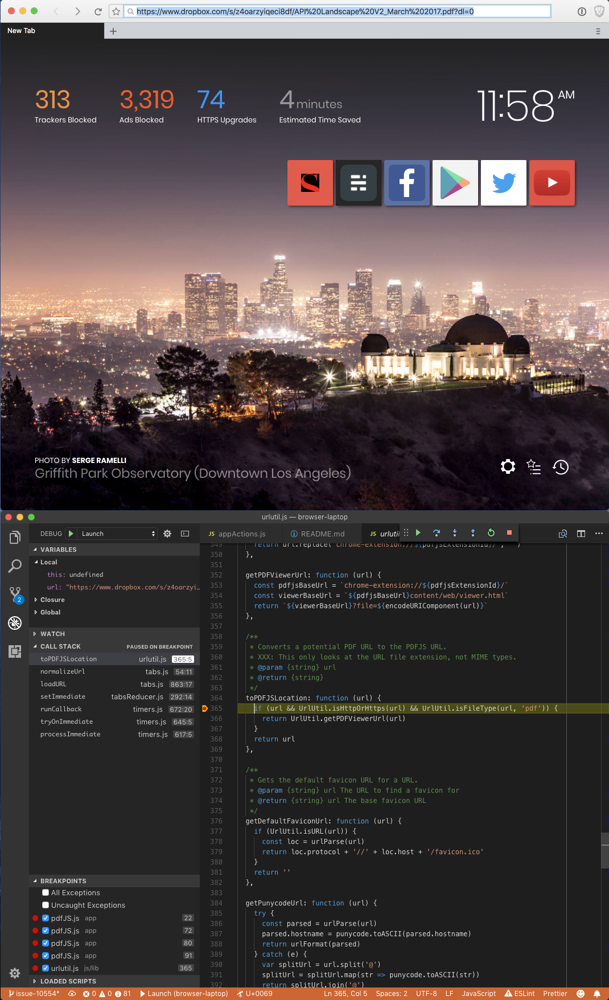
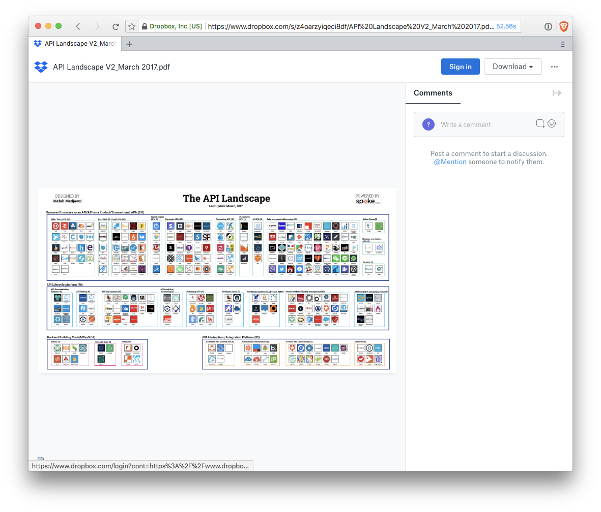
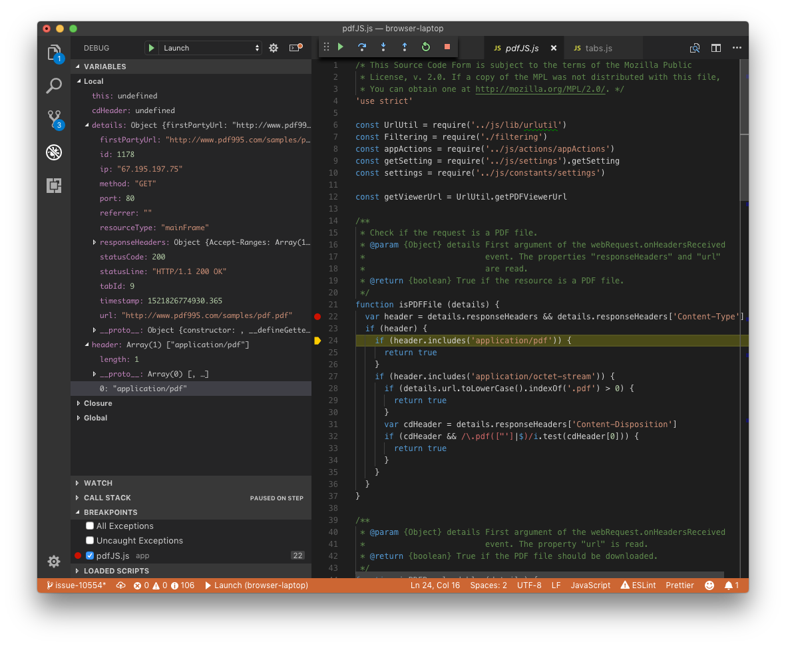
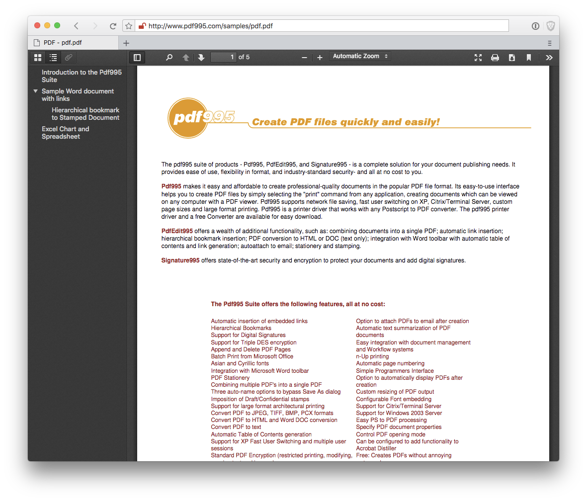
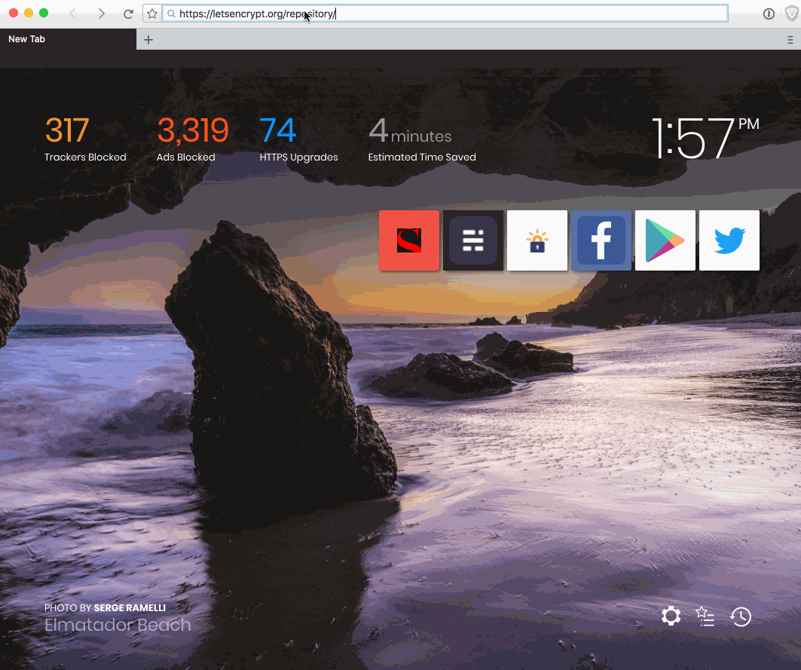

# Walkthrough: Fixing a Bug in the Brave Browser


Fixing a bug in a project the size of [Brave's desktop web browser](https://github.com/brave/browser-laptop/) can
seem overwhelming.  The following is a so-called ["good-first-experience"](http://blog.humphd.org/why-good-first-bugs-often-arent/)
walkthrough of how one might solve a real bug.  It is meant as a learning exercise
for my open source students at Seneca, or anyone else that is interested in
getting started fixing bugs in large projects. Our goal is to break the
process down and discuss the steps along the way, in an effort to familiarize
you with the process, and make it less of a magic trick and more the kind of
thing you would feel comfortable doing on your own.

During this walkthrough we will discuss and/or do the following:

* Work on a real bug in Brave
* Reproduce the bug in our own build
* Use the Visual Studio Code Debugging Tools to understand the bug
* Locate code associated with the problem using a variety of Debugging and Code Inspection techniques
* Fix the bug
* Run the tests
* Update the tests to allow for our fix

NOTE: I am doing this work in an old branch of [Brave](https://github.com/brave/browser-laptop/), and modifying things directly in the repo so that you can clone and checkout my branch if you want
to play along at home.  To do so:

```
git clone https://github.com/humphd/browser-laptop
cd browser-laptop
git checkout good-first-experience-issue-10554
```

Next, follow the [contributing instructions](CONTRIBUTING.md) and build docs in the
[README](README.md) to get Brave setup and built on your computer.  The remainder
of this walkthrough assumes that you know how to do the following:

* build Brave using `npm run watch`
* run your built browser using `npm start`
* debug the browser using VSCode, see [docs/debugging.md](docs/debugging.md)
* build the unit tests using `npm run watch-test`
* run the tests using `npm run test` and `npm run unittest`.  See [docs/tests.md](docs/tests.md)

## The Bug - when is a PDF not a PDF?

The bug we're going to fix involves PDFs, and how the browser displays them.
Currently in Brave, trying to load a URL with `.pdf` in the file extension
fails when the remote resource isn't actually a PDF file.  There are [many](https://github.com/brave/browser-laptop/issues/10554),
[many](https://github.com/brave/browser-laptop/issues/11059), [bugs filed](https://github.com/brave/browser-laptop/issues/12008) on this issue.

Before we can do anything about fixing this bug, we have to be able to
reproduce it in our own build of Brave.  This is an important first step, because
it could be that the released version of Brave (which lags behind what's in GitHub)
has the bug, while the code in the `master` branch does not.  Maybe it's already
been fixed.  Even if it hasn't been fixed, we need to be able to reproduce it
in order to test code changes (i.e., we want to know if *we've* fixed it).

In order to reproduce it, we need some test cases. From reading the bugs I linked
to above, here are two common cases, first with a PDF hosted on
Dropbox, then on GitHub:

* https://www.dropbox.com/s/4nfqksi0b1leh4o/Meet%20the%20Faculty%202017-18%20final.pdf?dl=0
* https://github.com/datproject/docs/blob/master/papers/dat-paper.pdf

And here's what my build of Brave looks like when I try to load them



Clicking the **More Information** link in the red error header reveals this:

```
Invalid or corrupted PDF file.
PDF.js v1.9.457 (build: 73aa2d92)
Message: Invalid PDF structure
```

Trying to load these files in Firefox works.  This is telling, since Firefox
also uses [PDF.js](https://mozilla.github.io/pdf.js/) to render PDFs.  As such, 
I don't think that the PDF files are really corrupted.  Instead, something else
is going on.

In both cases, an HTML page is being returned by the web servers, which embeds
the PDF somehow, whether as images, in a custom viewer, etc.

The bug can be summed up by saying that we shouldn't use `.pdf` in a URL to determine
whether or not a resource on the web is actually a PDF.  Instead, we should really
be looking at the headers we get when we download the file.  Let's look at
what comes back when we try to open the URLs above:

```
$ curl -I https://www.dropbox.com/s/4nfqksi0b1leh4o/Meet%20the%20Faculty%202017-18%20final.pdf?dl=0
HTTP/2 200
server: nginx
date: Fri, 23 Mar 2018 20:14:59 GMT
content-type: text/html; charset=utf-8
...

$ curl -I https://github.com/datproject/docs/blob/master/papers/dat-paper.pdf
HTTP/1.1 200 OK
Server: GitHub.com
Date: Fri, 23 Mar 2018 20:15:42 GMT
Content-Type: text/html; charset=utf-8
Status: 200 OK
...
```

In both cases, our `.pdf` URLs are really `text/html` web pages. 
Our goal will be to teach this fact to Brave.

## Finding and Understanding the Code

Now that we can successfully recreate this bug, it's time to try and locate the
code that causes the issue.  But where to begin?  Brave has [over 1.5 million
lines of code](https://www.openhub.net/p/browser-laptop).

Because we know that this bug involves PDFs, and because "pdf" is a pretty unique
term, it's worth doing a search through the code to find all references to it.
This approach won't always work, since we sometimes don't have a term that's easy
to search for, or our term would return too many results.  Every bug needs a slightly
different approach, but in this case, searching the source might be all we need:

```
$ git grep -i pdf
app/browser/tabs.js:const {isURL, getUrlFromInput, toPDFJSLocation, getDefaultFaviconUrl, isHttpOrHttps, getLocationIfPDF} = require('../../js/lib/urlutil')
app/browser/tabs.js:  if (settingsStore.getSetting(settings.PDFJS_ENABLED)) {
app/browser/tabs.js:    url = toPDFJSLocation(url)
app/browser/tabs.js:  navigationEntry.virtualURL = getLocationIfPDF(navigationEntry.virtualURL)
app/browser/windows.js:const {getLocationIfPDF} = require('../../js/lib/urlutil')
app/browser/windows.js:  const matchesLocation = getLocationIfPDF(tab.get('url')) === site.get('location')
app/common/cache/bookmarkLocationCache.js:  return UrlUtil.getLocationIfPDF(location)
app/common/lib/bookmarkUtil.js:    location = UrlUtil.getLocationIfPDF(location)
app/common/lib/bookmarkUtil.js:    location = UrlUtil.getLocationIfPDF(bookmarkDetail.get('location'))
app/common/lib/bookmarkUtil.js:    location = UrlUtil.getLocationIfPDF(newBookmark.get('location'))
app/common/lib/historyUtil.js:    location = UrlUtil.getLocationIfPDF(location)
app/common/lib/pinnedSitesUtil.js:    location = UrlUtil.getLocationIfPDF(location)
app/common/state/historyState.js:        location = urlUtil.getLocationIfPDF(siteDetail.get('location'))
app/common/state/pinnedSitesState.js:      location = urlUtil.getLocationIfPDF(site.get('location'))
app/extensions.js:// Analagous to the PDFJS extension, it shows a special UI for that type of resource
app/extensions.js:    const isPDF = extensionId === config.PDFJSExtensionId
app/extensions.js:    if (isPDF) {
app/extensions.js:      // Override the manifest. TODO: Update manifest in pdf.js itself after enough
app/extensions.js:        name: 'PDF Viewer',
app/extensions.js:        description: 'Uses HTML5 to display PDF files directly in the browser.',
app/extensions.js:        key: config.PDFJSExtensionPublicKey
app/extensions.js:    if (getSetting(settings.PDFJS_ENABLED)) {
app/extensions.js:      registerComponent(config.PDFJSExtensionId, config.PDFJSExtensionPublicKey)
app/extensions.js:      disableExtension(config.PDFJSExtensionId)
app/filtering.js:const pdfjsOrigin = `chrome-extension://${config.PDFJSExtensionId}`
app/filtering.js:          firstPartyOrigin !== pdfjsOrigin && !hasCookieException) {
app/filtering.js:    const isPDFOrigin = origin.startsWith(`${pdfjsOrigin}/`)
app/filtering.js:    if (mainFrameUrl === appUrlUtil.getBraveExtIndexHTML() || isPDFOrigin || isBraveOrigin) {
app/filtering.js:      origin = isPDFOrigin ? 'PDF Viewer' : 'Brave Browser'
app/filtering.js:        // The Brave extension and PDFJS are always allowed to open files in an external app
app/filtering.js:        isPDFOrigin || isBraveOrigin)) {
app/filtering.js:  if (resourceName === 'pdfjs') {
app/filtering.js:    return getSetting(settings.PDFJS_ENABLED, settingsState)
app/index.js:const PDFJS = require('./pdfJS')
app/index.js:    PDFJS.init()
app/pdf.js:const renderToPdf = (appState, action) => {
app/pdf.js:  tab.printToPDF({}, function (err, data) {
app/pdf.js:    let pdfDataURI = 'data:application/pdf;base64,' + data.toString('base64')
app/pdf.js:    tab.downloadURL(pdfDataURI, true, savePath)
app/pdf.js:  renderToPdf
app/pdfJS.js:const getViewerUrl = UrlUtil.getPDFViewerUrl
app/pdfJS.js: * Check if the request is a PDF file.
app/pdfJS.js: * @return {boolean} True if the resource is a PDF file.
app/pdfJS.js:function isPDFFile (details) {
app/pdfJS.js:    if (header.includes('application/pdf')) {
app/pdfJS.js:      if (details.url.toLowerCase().indexOf('.pdf') > 0) {
app/pdfJS.js:      if (cdHeader && /\.pdf(["']|$)/i.test(cdHeader[0])) {
app/pdfJS.js: * @return {boolean} True if the PDF file should be downloaded.
app/pdfJS.js:function isPDFDownloadable (details) {
app/pdfJS.js:  if (details.url.indexOf('pdfjs.action=download') >= 0) {
app/pdfJS.js:  // Display the PDF viewer regardless of the Content-Disposition header if the
app/pdfJS.js:  // a PDF, and servers are often misconfigured.
app/pdfJS.js:  // viewer to open the PDF, but first check whether the Content-Disposition
app/pdfJS.js:  const result = { resourceName: 'pdfjs' }
app/pdfJS.js:    UrlUtil.isFileType(details.url, 'pdf')) {
app/pdfJS.js:  const result = { resourceName: 'pdfjs' }
app/pdfJS.js:  if (details.resourceType === 'mainFrame' && details.method === 'GET' && isPDFFile(details)) {
app/pdfJS.js:    if (isPDFDownloadable(details)) {
app/pdfJS.js: * Load PDF.JS
app/pdfJS.js:  if (getSetting(settings.PDFJS_ENABLED)) {
app/renderer/components/frame/frame.js:function isPDFJSURL (url) {
app/renderer/components/frame/frame.js:  const pdfjsOrigin = `chrome-extension://${config.PDFJSExtensionId}/`
app/renderer/components/frame/frame.js:  return url && url.startsWith(pdfjsOrigin)
app/renderer/components/frame/frame.js:    // Counter for detecting PDF URL redirect loops
app/renderer/components/frame/frame.js:        } else if (isPDFJSURL(this.props.location)) {
app/renderer/components/frame/frame.js:            UrlUtil.getLocationIfPDF(this.props.location))
app/renderer/components/frame/frame.js:        const downloadLocation = getSetting(settings.PDFJS_ENABLED)
app/renderer/components/frame/frame.js:          ? UrlUtil.getLocationIfPDF(this.props.tabUrl)
app/renderer/components/frame/frame.js:      if (isPDFJSURL(url)) {
app/renderer/components/frame/frame.js:        let displayLocation = UrlUtil.getLocationIfPDF(url)
app/renderer/components/preferences/payment/history.js:    return `${this.transaction.get('exportFilenamePrefix')}.pdf`
app/renderer/lib/extensionsUtil.js:const pdfjs = config.PDFJSExtensionId
app/renderer/lib/extensionsUtil.js:    case pdfjs:
app/renderer/lib/extensionsUtil.js:      extensionSetting = settings.PDFJS_ENABLED
app/renderer/reducers/contextMenuReducer.js:      siteDetail = siteDetail.set('location', urlUtil.getLocationIfPDF(siteDetail.get('location')))
docs/state.md:    'advanced.pdfjs-enabled': boolean, // whether or not to render PDF documents in the browser
js/about/aboutActions.js:   * Dispatches a message to render the tab into a PDF file
js/about/aboutActions.js:  renderToPdf: function (savePath) {
js/about/aboutActions.js:      actionType: appConstants.APP_RENDER_TO_PDF,
js/about/contributionStatement.js:      savedPDF: false,
js/about/contributionStatement.js:      if (!this.state.savedPDF) {
js/about/contributionStatement.js:        this.setState({savedPDF: true})
js/about/contributionStatement.js:          this.renderPdf()
js/about/contributionStatement.js:    // Convert images to base64 so it can be seen if PDF is saved as HTML
js/about/contributionStatement.js:    return `${transaction.get('exportFilenamePrefix')}.pdf`
js/about/contributionStatement.js:  renderPdf () {
js/about/contributionStatement.js:    aboutActions.renderToPdf(this.receiptFileName())
js/about/preferences.js:      settings.PDFJS_ENABLED,
js/constants/appConfig.js:    'advanced.pdfjs-enabled': true,
js/constants/appConstants.js:  APP_RENDER_TO_PDF: _,
js/constants/config.js:  // PDFJS
js/constants/config.js:  // Parent repo: https://github.com/diracdeltas/pdf.js
js/constants/config.js:  // Use Chromium to package build/chormium with the brave private key for pdfjs.
js/constants/config.js:  PDFJSExtensionId: 'jdbefljfgobbmcidnmpjamcbhnbphjnb',
js/constants/config.js:  PDFJSExtensionPublicKey: 'MIIBIjANBgkqhkiG9w0BAQEFAAOCAQ8AMIIBCgKCAQEAqmqh6Kxmj00IjKvjPsCtw6g2BHvKipjS3fBD0IInXZZ57u5oZfw6q42L7tgWDLrNDPvu3XDH0vpECr+IcgBjkM+w6+2VdTyPj5ubngTwvBqCIPItetpsZNJOJfrFw0OIgmyekZYsI+BsK7wiMtHczwfKSTi0JKgrwIRhHbEhpUnCxFhi+zI61p9jwMb2EBFwxru7MtpP21jG7pVznFeLV9W9BkNL1Th9QBvVs7GvZwtIIIniQkKtqT1wp4IY9/mDeM5SgggKakumCnT9D37ZxDnM2K13BKAXOkeH6JLGrZCl3aXmqDO9OhLwoch+LGb5IaXwOZyGnhdhm9MNA3hgEwIDAQAB',
js/constants/messages.js:  RENDER_URL_TO_PDF: _,
js/constants/messages.js:  // PDFJS
js/constants/settings.js:  PDFJS_ENABLED: 'advanced.pdfjs-enabled',
js/contextMenus.js:      siteDetail = siteDetail.set('location', urlUtil.getLocationIfPDF(siteDetail.get('location')))
js/lib/urlutil.js:const pdfjsExtensionId = require('../constants/config').PDFJSExtensionId
js/lib/urlutil.js:   * Gets PDF location from a potential PDFJS URL
js/lib/urlutil.js:  getLocationIfPDF: function (url) {
js/lib/urlutil.js:    if (!url || url.indexOf(`chrome-extension://${pdfjsExtensionId}/`) === -1) {
js/lib/urlutil.js:    return url.replace(`chrome-extension://${pdfjsExtensionId}/`, '')
js/lib/urlutil.js:  getPDFViewerUrl: function (url) {
js/lib/urlutil.js:    const pdfjsBaseUrl = `chrome-extension://${pdfjsExtensionId}/`
js/lib/urlutil.js:    const viewerBaseUrl = `${pdfjsBaseUrl}content/web/viewer.html`
js/lib/urlutil.js:   * Converts a potential PDF URL to the PDFJS URL.
js/lib/urlutil.js:  toPDFJSLocation: function (url) {
js/lib/urlutil.js:    if (url && UrlUtil.isHttpOrHttps(url) && UrlUtil.isFileType(url, 'pdf')) {
js/lib/urlutil.js:      return UrlUtil.getPDFViewerUrl(url)
js/stores/appStore.js:    case appConstants.APP_RENDER_TO_PDF:
js/stores/appStore.js:      const pdf = require('../../app/pdf')
js/stores/appStore.js:      appState = pdf.renderToPdf(appState, action)
js/stores/windowStore.js:        bookmarkDetail = bookmarkDetail.set('location', UrlUtil.getLocationIfPDF(bookmarkDetail.get('location')))
package-lock.json:          "integrity": "sha1-e8ZYtL7WHu5CStdPdfXD4sTfPMc=",
package.json:    "update-pdfjs": "rm -r app/extensions/pdfjs/; cp -r ../pdf.js/build/chromium/ app/extensions/pdfjs/",
```

This is a partial list.  I've pre-removed a lot of lines that were not code related (Changelog entries, locale string translations, things in `res/` for the installer, etc), or were in tests
(we'll look at those later).  But even still, it's a lot!

Let's quickly scan this list to see what might be interesting for further research.
At first, I'm not worrying about what everything means.  This is an important enough
point that it's worth pausing over for a second: I'm not interested in understanding
everything; rather, I want to fix this bug.  I'm going to be strategic in what I
spend time on, since getting bogged down in details now will only make it harder
for me to accomplish my goal.  I just want to get a sense of what's here, and where.

You probably noticed some things as you scrolled through that list.  Here's what I saw:

* `app/browser/tabs.js` seems to be code related to showing a PDF in the current tab.
* `app/extensions.js` and `app/renderer/lib/extensionsUtil.js` seem to be dealing with whether or not PDF features are enabled.  They also imply that PDFs are rendered via an extension
* `app/filtering.js` seems to be security related, deciding whether to open a PDF
* `app/pdf.js` seems to be related to "printing" web contents to a PDF
* `app/pdfJS.js` seems to be dealing with PDF-type headers and HTTP requests 
* `app/renderer/components/frame/frame.js` seems to be dealing with PDFs in frames (e.g., `iframe` maybe?)
* `js/lib/urlutil.js` seems to be related to identifying and parsing PDF URLs.

There are also other files that seem to deal with saving, bookmarking, rendering,
and otherwise dealing with PDF files in one way or another.
Since our bug relates to how a PDF gets loaded via URL, and based
on our quick overview of the code, it looks like it might be worth while diving
into a few of the files above, specifically [`app/pdfJS.js`](https://github.com/brave/browser-laptop/blob/1517df68e8f94ede2842913cc97224b1f3c5b1cb/app/pdfJS.js)
 and [`js/lib/urlutil.js`](https://github.com/brave/browser-laptop/blob/1517df68e8f94ede2842913cc97224b1f3c5b1cb/js/lib/urlutil.js).

## Reading Code

Let's first look at [`js/lib/urlutil.js`](https://github.com/brave/browser-laptop/blob/1517df68e8f94ede2842913cc97224b1f3c5b1cb/js/lib/urlutil.js).
Here we find various functions for dealing with PDF URLs:

* [extracting a PDF filename from a URL](https://github.com/brave/browser-laptop/blob/1517df68e8f94ede2842913cc97224b1f3c5b1cb/js/lib/urlutil.js#L331-L350)
* [creating a PDF viewer URL for a resource](https://github.com/brave/browser-laptop/blob/1517df68e8f94ede2842913cc97224b1f3c5b1cb/js/lib/urlutil.js#L352-L356)
* [inspecting and converting a URL to a PDF Viewer URL](https://github.com/brave/browser-laptop/blob/1517df68e8f94ede2842913cc97224b1f3c5b1cb/js/lib/urlutil.js#L358-L369)

Reading this code proves to be worth while, since buried in a comment
we find this very interesting clue:

```js
/**
 * Converts a potential PDF URL to the PDFJS URL.
 * XXX: This only looks at the URL file extension, not MIME types.
 * @param {string} url
 * @return {string}
 */
toPDFJSLocation: function (url) {
  if (url && UrlUtil.isHttpOrHttps(url) && UrlUtil.isFileType(url, 'pdf')) {
    return UrlUtil.getPDFViewerUrl(url)
  }
  return url
},
```

This function takes a `url` argument, and if it's using HTTP or HTTPS, and its file
extension ends with `pdf`, it converts it to a PDF Viewer URL.  But just look
at that comment on the second line:

```
XXX: This only looks at the URL file extension, not MIME types.
```

Whenever you see an `XXX` or `TODO` style comment in code, it usually means there's
some follow-up required.  In this case, there's a note from the last person to touch this
code that we're not examining MIME types, only file extensions.  This is exactly
the problem we're seeing in our bug.

>**TIP**: A better strategy for indicating follow-up tasks is to file a bug, and
>leave a comment with a link to the bug.  The problem with using simple code comments
>is that they get lost over time.  Developers on a project come and go, and it might
>be that no one looks at this code, and its `XXX` comment again for a long time;
>perhaps only when we discover some interconnected bug.  By filing an issue, we
>better enable the project to track future needs, bugs, and technical debt.

It can be useful to understand what was going on when code was added.  We can
use [`git blame` info for this line](https://github.com/brave/browser-laptop/blame/1517df68e8f94ede2842913cc97224b1f3c5b1cb/js/lib/urlutil.js#L360) to get a better view into what happened.

Based on info in `git`, we can see that this was [added in a fix](https://github.com/brave/browser-laptop/commit/121a3bbb2d52d5a96bf20342ac98a1173667d47d)
for [Issue 8364](https://github.com/brave/browser-laptop/issues/8364) a year ago.  The pull
request can be found [here](https://github.com/brave/browser-laptop/pull/8366).

>**TIP**: despite its name, `git blame` isn't (or shouldn't be) about assigning blame.
>Rather, we use it in order to understand source code archaeology: why was something done?
>what were the goals?  did any info get recorded that would help us craft our fix?  which
>other files were touched along with this change? and, one often important detail: who
>was involved in writing, testing, reviewing the code?  Maybe
>we can ask them follow-up questions now, as we work to fix things, or get them to
>review our fix.  The people who wrote the code you're working on are often a great
>resource, since they've trodden the ground where you now stand.

Let's go further and read [`app/pdfJS.js`](https://github.com/brave/browser-laptop/blob/1517df68e8f94ede2842913cc97224b1f3c5b1cb/app/pdfJS.js).
Here we find code for:

* [checking if a request is for a PDF](https://github.com/brave/browser-laptop/blob/1517df68e8f94ede2842913cc97224b1f3c5b1cb/app/pdfJS.js#L14-L37) based on headers (e.g., `Content-Type`) and extension (`.pdf`)
* [determining whether to download or display](https://github.com/brave/browser-laptop/blob/1517df68e8f94ede2842913cc97224b1f3c5b1cb/app/pdfJS.js#L39-L62) the PDF
* [filtering requests](https://github.com/brave/browser-laptop/blob/1517df68e8f94ede2842913cc97224b1f3c5b1cb/app/pdfJS.js#L79-L105) to intercept PDFs before they get loaded by other parts of the browser

This seems like exactly what we're after.  Consider this code in light of the "TODO" 
comment we found relating to not examining MIME type info for PDF URLs.  Here we
have code that does in fact deal with PDF MIME types in requests.  Maybe we can
combine these two in order to solve our bug?

## Debugging

Let's continue our investigation by figuring out when these files, and their functions,
get called, and by whom.  Because I have steps to reproduce this bug, I'm interested to see if and when the code we've found above gets called in the course of loading the affected URLs.

To do that, let's set some breakpoints.  In a [previous walkthrough fixing a bug
in VSCode](https://github.com/humphd/vscode/tree/good-first-experience-issue-42726#walkthrough-fixing-a-bug-in-visual-studio-code)
I used the [Chrome DevTools](https://developers.google.com/web/tools/chrome-devtools/)
to debug.  For something different, and because
I'm using [VSCode](https://code.visualstudio.com/) to develop Brave, let's try and
debug using the dev tools built into the VSCode editor itself.  The Brave docs have an
[excellent page on Debugging](https://github.com/brave/browser-laptop/blob/master/docs/debugging.md), which lists [specific instructions for debugging under VSCode](https://github.com/brave/browser-laptop/blob/master/docs/debugging.md#debugging-the-browser-process-with-vs-code).
Combine that with the [docs for how to debug using VSCode](https://code.visualstudio.com/docs/editor/debugging) and we're ready. 

First, we [set breakpoints](https://code.visualstudio.com/docs/editor/debugging#_breakpoints) in all the functions we want to inspect:



Next we [build and run](https://github.com/brave/browser-laptop#running-brave)
our Brave source and choose either the [`Attach` or `Launch` configurations](https://code.visualstudio.com/docs/editor/debugging#_launch-configurations)
in the Debug menu, before pressing the green Debug Start button.

We should now have a running Brave browser, and VSCode with our breakpoints set.
Let's try and trigger them by pasting a [URL from the bug](https://github.com/brave/browser-laptop/issues/10554#issuecomment-375610035) into the URL bar:

https://www.dropbox.com/s/z4oarzyiqeci8df/API%20Landscape%20V2_March%202017.pdf?dl=0

This URL points to an HTML web page (i.e., Dropbox's web viewer for a PDF file), but
uses the `.pdf` extension in the filename, since that's what the underlying file
that the viewer will display is called.

After pasting the URL and pressing Enter, I'm immediately dropped into the debugger:



In the debugger's **VARIABLES** panel, under **Local** variables, we can clearly
see that we've paused to process our URL from Dropbox:

```json
url: "https://www.dropbox.com/s/z4oarzyiqeci8df/API%20Landscape%20V2_March%202017.pdf?dl=0"
```

The code checks that `url` exists (it does), that it's either HTTP or HTTPS (it is),
and whether or not it uses `.pdf` in its filename (it does).  As such, it gets
rewritten to a PDF Viewer URL:

```
chrome-extension://jdbefljfgobbmcidnmpjamcbhnbphjnb/content/web/viewer.html?file=https%3A%2F%2Fwww.dropbox.com%2Fs%2Fz4oarzyiqeci8df%2FAPI%2520Landscape%2520V2_March%25202017.pdf%3Fdl%3D0
```

In the debugger's **CALL STACK** panel, we see the flow of what will happen with this URL:

```
toPDFJSLocation      urlutil.js:365
normalizeUrl         tab.js:54
loadURL              tab.js:863
```

In [tab.js](https://github.com/brave/browser-laptop/blob/1517df68e8f94ede2842913cc97224b1f3c5b1cb/app/browser/tabs.js#L858-L877) the URL is eventually passed to `tab.loadURL(url)`,
which seems to pass it over to Electron's webview code for loading.

Interestingly, none of our other breakpoints in `pdfJS.js` are ever hit during
this process.  I would have expected that our PDF, once we enter its URL, would get
handled by the checks in `pdfJS.js` as it gets downloaded.  But that's not happening,
presumably because we're short-circuiting this process by instead handing the
request off to the [PDF.js Chrome Extension](https://chrome.google.com/webstore/detail/pdf-viewer/oemmndcbldboiebfnladdacbdfmadadm).

This makes me curious. What if we didn't do that?  What if we just let this URL
load without involving the PDF Viewer?  I'm curious to see these other breakpoints
get hit.  I assume they've not been triggered because the PDF Viewer has downloaded
the URL itself, bypassing the rest of the browser code we care about.  As an
experiment, let's remove the PDF checks and URL rewriting in `urlutil.js`:

```js
toPDFJSLocation: function (url) {
// XXX: skip the PDF viewer check so we always load the url as is.
//     if (url && UrlUtil.isHttpOrHttps(url) && UrlUtil.isFileType(url, 'pdf')) {
//      return UrlUtil.getPDFViewerUrl(url)
//    }
  return url
},

```

Interestingly, after rebuilding and loading the previous URL, this change allows
the page to load as expected:



The browser has correctly loaded an HTML page, even though it uses a `.pdf` filename.
I also see my breakpoints in `pdfJS.js` get hit, as it processes the request
and its headers looking for `Content-Type` clues of a PDF (which it doesn't find).

What would happen if I loaded a real PDF?  Would this now break the PDF Viewer?
Here's another URL that uses `.pdf`: http://www.pdf995.com/samples/pdf.pdf.
However, this time it really is a PDF resource at the other end of a `.pdf` URL:

```
$ curl -I http://www.pdf995.com/samples/pdf.pdf
HTTP/1.1 200 OK
Date: Fri, 23 Mar 2018 17:08:57 GMT
P3P: policyref="http://info.yahoo.com/w3c/p3p.xml", CP="CAO DSP COR CUR ADM DEV TAI PSA PSD IVAi IVDi CONi TELo OTPi OUR DELi SAMi OTRi UNRi PUBi IND PHY ONL UNI PUR FIN COM NAV INT DEM CNT STA POL HEA PRE LOC GOV"
Cache-Control: max-age=864000
Last-Modified: Sat, 13 Dec 2003 01:36:20 GMT
Accept-Ranges: bytes
Content-Length: 433994
Content-Type: application/pdf
Expires: Mon, 02 Apr 2018 17:08:57 GMT
Age: 1717
Connection: keep-alive
Server: ATS/7.1.0
``` 

Notice the `Content-Type: application/pdf` in the headers vs. the
`content-type: text/html; charset=utf-8` we get for the URL from Dropbox.
Let's try loading this in Brave:



Once again we've landed in `isPDFFile()`, which checks whether a
resource is a PDF or not, based on information in headers and the extension.
Because the headers include `application/pdf`, this request is correctly
identified as a PDF resource and loaded in the viewer:



## Making a Fix

Based on our previous experiment, it looks like we don't need to pre-process
PDF URLs at all, and can just let the browser load them normally,
knowing the right thing will happen once the request is begun.

But why would this be?  Once again, `git blame` gives us a clue.  Take a look at the
[history of the `pdfJS.js` file, and `isPDFFile()`](https://github.com/brave/browser-laptop/blame/1517df68e8f94ede2842913cc97224b1f3c5b1cb/app/pdfJS.js#L21).

The code that solves our bug was added 4 months ago, while the code that's
causing it was added 11 months ago.  In other words, the **TODO** comment
we saw earlier has been fixed in the interim, but this band-aid fix, based
only on filename extension vs. MIME type, hasn't been removed.  It needs to be.

Let's confirm that removing it wouldn't break the cases the original PR 
was trying to fix.  Once again, [here's the original bug](https://github.com/brave/browser-laptop/issues/8364), and the case in question:

1. go to https://letsencrypt.org/repository/
2. right click on any of the PDF links to open in a new tab. it should work.
3. right click on any of the PDF links to open in a new private tab. it should work.

Let's confirm this change won't regress the previous fix:



Indeed, this is still fixed after removing the URL check on `.pdf`.  Looking at
the code in `pdfJS.js` we can see why:

```js
const onHeadersReceived = (details) => {
  const result = { resourceName: 'pdfjs' }
  // Don't intercept POST requests until http://crbug.com/104058 is fixed.
  if (details.resourceType === 'mainFrame' && details.method === 'GET' && isPDFFile(details)) {
    if (isPDFDownloadable(details)) {
      // Force download by ensuring that Content-Disposition: attachment is set
      result.responseHeaders = getHeadersWithContentDispositionAttachment(details)
      return result
    }

    // Replace frame with viewer
    appActions.loadURLRequested(details.tabId, getViewerUrl(details.url))
    result.cancel = true
  }
  return result
}
```

The call to `getViewerUrl()` toward the end is really calling `UrlUtil.getPDFViewerUrl`,
which means that this newer code in `pdfJS.js` is doing the same thing as
the current code, but waiting until *after* the resource is requested and its
headers are known.

Based on this, we can safely remove all references to `UrlUtil.toPDFJSLocation`:

```diff
diff --git a/app/browser/tabs.js b/app/browser/tabs.js
index 999064a45..48180db11 100644
--- a/app/browser/tabs.js
+++ b/app/browser/tabs.js
@@ -11,7 +11,7 @@ const tabState = require('../common/state/tabState')
 const {app, BrowserWindow, extensions, session, ipcMain} = require('electron')
 const {makeImmutable, makeJS} = require('../common/state/immutableUtil')
 const {getTargetAboutUrl, getSourceAboutUrl, isSourceAboutUrl, newFrameUrl, isTargetAboutUrl, isIntermediateAboutPage, isTargetMagnetUrl, getSourceMagnetUrl} = require('../../js/lib/appUrlUtil')
-const {isURL, getUrlFromInput, toPDFJSLocation, getDefaultFaviconUrl, isHttpOrHttps, getLocationIfPDF} = require('../../js/lib/urlutil')
+const {isURL, getUrlFromInput, getDefaultFaviconUrl, isHttpOrHttps, getLocationIfPDF} = require('../../js/lib/urlutil')
 const {isSessionPartition} = require('../../js/state/frameStateUtil')
 const {getOrigin} = require('../../js/lib/urlutil')
 const settingsStore = require('../../js/settings')
@@ -50,9 +50,6 @@ const normalizeUrl = function (url) {
   if (isURL(url)) {
     url = getUrlFromInput(url)
   }
-  if (settingsStore.getSetting(settings.PDFJS_ENABLED)) {
-    url = toPDFJSLocation(url)
-  }
   return url
 }
 
diff --git a/js/lib/urlutil.js b/js/lib/urlutil.js
index a5a540fb2..8f561e872 100644
--- a/js/lib/urlutil.js
+++ b/js/lib/urlutil.js
@@ -355,19 +355,6 @@ const UrlUtil = {
     return `${viewerBaseUrl}?file=${encodeURIComponent(url)}`
   },
 
-  /**
-   * Converts a potential PDF URL to the PDFJS URL.
-   * XXX: This only looks at the URL file extension, not MIME types.
-   * @param {string} url
-   * @return {string}
-   */
-  toPDFJSLocation: function (url) {
-    if (url && UrlUtil.isHttpOrHttps(url) && UrlUtil.isFileType(url, 'pdf')) {
-      return UrlUtil.getPDFViewerUrl(url)
-    }
-    return url
-  },
-
   /**
    * Gets the default favicon URL for a URL.
    * @param {string} url The URL to find a favicon for
```

## Tests

We're almost done, but there's still the issue of tests.  Our fix involves removing
an API and all its callers.  What about tests that rely on `toPDFJSLocation()`?
We know from our previous research that [the original PR added tests](https://github.com/brave/browser-laptop/commit/121a3bbb2d52d5a96bf20342ac98a1173667d47d#diff-67408f7e7eb48fc100595349f7540aa9R192)
along with this fix.

Fixing bugs in open source projects is only partly about the code.  Big projects
like Brave will also want to see us add test coverage for new code, updates to
existing tests when we modify things, regression tests when we fix a bug, etc.

Earlier we used `git grep` to look for all occurrences of `'pdf'` in Brave, and
ignored the code under `test/*`.  Now it's time to revisit those:

```
$ git grep -i "pdf" test/
test/about/extensionsTest.js:  describe('PDFJS', function () {
test/bookmark-components/bookmarksTest.js:    describe('bookmark pdf', function () {
test/bookmark-components/bookmarksTest.js:      it('load pdf', function * () {
test/bookmark-components/bookmarksTest.js:        const page1Url = Brave.server.url('img/test.pdf')
test/bookmark-components/bookmarksTest.js:        const page1Url = Brave.server.url('img/test.pdf')
test/bookmark-components/bookmarksTest.js:        let title = 'test.ico - test.pdf'
Binary file test/fixtures/img/test.pdf matches
test/navbar-components/navigationBarTest.js:    it('shows insecure icon on an HTTP PDF', function * () {
test/navbar-components/navigationBarTest.js:      const page1Url = Brave.server.url('img/test.pdf')
test/navbar-components/navigationBarTest.js:    it('shows secure icon on an HTTPS PDF', function * () {
test/navbar-components/navigationBarTest.js:      const page1Url = 'https://letsencrypt.org/documents/ISRG-CPS-October-18-2016.pdf'
test/tab-components/frameTest.js:    it('loads a PDF', function * () {
test/tab-components/frameTest.js:      let url = Brave.server.url('img/test.pdf')
test/tab-components/pinnedTabTest.js:    it('can pin a PDF', function * () {
test/tab-components/pinnedTabTest.js:      const pdfUrl = 'http://orimi.com/pdf-test.pdf'
test/tab-components/pinnedTabTest.js:        .url(pdfUrl)
test/tab-components/pinnedTabTest.js:        .pause(1000) // wait for PDF load
test/unit/app/renderer/components/preferences/extensionsTabTest.js:    mockery.registerMock('../../../../extensions/brave/img/extensions/pdfjs-128.png')
test/unit/app/renderer/components/preferences/extensionsTabTest.js:      describe('pdfjs', function () {
test/unit/app/renderer/components/preferences/extensionsTabTest.js:              extensions={extensions(config.PDFJSExtensionId, false, false)}
test/unit/app/renderer/components/preferences/extensionsTabTest.js:          assert.equal(wrapper.find(`[data-extension-id="${config.PDFJSExtensionId}"]`).length, 1)
test/unit/app/renderer/components/preferences/extensionsTabTest.js:              extensions={extensions(config.PDFJSExtensionId, false, true)}
test/unit/app/renderer/components/preferences/extensionsTabTest.js:          assert.equal(wrapper.find(`[data-extension-id="${config.PDFJSExtensionId}"]`).length, 0)
test/unit/app/renderer/components/preferences/extensionsTabTest.js:              extensions={extensions(config.PDFJSExtensionId, true, false)}
test/unit/app/renderer/components/preferences/extensionsTabTest.js:              extensions={extensions(config.PDFJSExtensionId, false, false)}
test/unit/lib/urlutilTest.js:      assert.equal(urlUtil.isFileType('/file/abc/test.pdf', 'pdf'), true)
test/unit/lib/urlutilTest.js:      assert.equal(urlUtil.isFileType('/file/abc/test', 'pdf'), false)
test/unit/lib/urlutilTest.js:  describe('toPDFJSLocation', function () {
test/unit/lib/urlutilTest.js:    it('pdf', function () {
test/unit/lib/urlutilTest.js:      assert.equal(urlUtil.toPDFJSLocation('http://abc.com/test.pdf'), baseUrl + 'content/web/viewer.html?file=http%3A%2F%2Fabc.com%2Ftest.pdf')
test/unit/lib/urlutilTest.js:    it('non-pdf', function () {
test/unit/lib/urlutilTest.js:      assert.equal(urlUtil.toPDFJSLocation('http://abc.com/test.pdf.txt'), 'http://abc.com/test.pdf.txt')
test/unit/lib/urlutilTest.js:      assert.equal(urlUtil.toPDFJSLocation('file://abc.com/test.pdf.txt'), 'file://abc.com/test.pdf.txt')
test/unit/lib/urlutilTest.js:      assert.equal(urlUtil.toPDFJSLocation(''), '')
test/unit/lib/urlutilTest.js:  describe('getPDFViewerUrl', function () {
test/unit/lib/urlutilTest.js:      assert.equal(urlUtil.getPDFViewerUrl('http://example.com'), baseUrl + 'http%3A%2F%2Fexample.com')
test/unit/lib/urlutilTest.js:      assert.equal(urlUtil.getPDFViewerUrl('file:///Users/yan/some files/test.pdf'), baseUrl + 'file%3A%2F%2F%2FUsers%2Fyan%2Fsome%20files%2Ftest.pdf')
test/unit/lib/urlutilTest.js:  describe('getLocationIfPDF', function () {
test/unit/lib/urlutilTest.js:    it('gets location for PDF JS URL', function () {
test/unit/lib/urlutilTest.js:      assert.equal(urlUtil.getLocationIfPDF('chrome-extension://jdbefljfgobbmcidnmpjamcbhnbphjnb/https://www.blackhat.co…king-Kernel-Address-Space-Layout-Randomization-KASLR-With-Intel-TSX-wp.pdf'),
test/unit/lib/urlutilTest.js:        'https://www.blackhat.co…king-Kernel-Address-Space-Layout-Randomization-KASLR-With-Intel-TSX-wp.pdf')
test/unit/lib/urlutilTest.js:    it('gets location for PDF JS viewer URL', function () {
test/unit/lib/urlutilTest.js:      assert.equal(urlUtil.getLocationIfPDF('chrome-extension://jdbefljfgobbmcidnmpjamcbhnbphjnb/content/web/viewer.html?file=http%3A%2F%2Funec.edu.az%2Fapplication%2Fuploads%2F2014%2F12%2Fpdf-sample.pdf'),
test/unit/lib/urlutilTest.js:        'http://unec.edu.az/application/uploads/2014/12/pdf-sample.pdf')
test/unit/lib/urlutilTest.js:    it('does not remove wayback machine url location for PDF JS URL', function () {
test/unit/lib/urlutilTest.js:      assert.equal(urlUtil.getLocationIfPDF('chrome-extension://jdbefljfgobbmcidnmpjamcbhnbphjnb/https://web.archive.org/web/20160106152308/http://stlab.adobe.com/wiki/images/d/d3/Test.pdf'),
test/unit/lib/urlutilTest.js:        'https://web.archive.org/web/20160106152308/http://stlab.adobe.com/wiki/images/d/d3/Test.pdf')
test/unit/lib/urlutilTest.js:    it('does not modify location for non-pdf URL', function () {
test/unit/lib/urlutilTest.js:      assert.equal(urlUtil.getLocationIfPDF('https://www.blackhat.co…king-Kernel-Address-Space-Layout-Randomization-KASLR-With-Intel-TSX-wp.pdf'),
test/unit/lib/urlutilTest.js:        'https://www.blackhat.co…king-Kernel-Address-Space-Layout-Randomization-KASLR-With-Intel-TSX-wp.pdf')
test/unit/lib/urlutilTest.js:      assert.equal(urlUtil.getLocationIfPDF('chrome-extension://blank'), 'chrome-extension://blank')
test/unit/lib/urlutilTest.js:      assert.equal(urlUtil.getLocationIfPDF(null), null)
test/unit/lib/urlutilTest.js:    it('gets location for file: PDF URL', function () {
test/unit/lib/urlutilTest.js:      let url = 'chrome-extension://jdbefljfgobbmcidnmpjamcbhnbphjnb/file:///Users/yan/Downloads/test.pdf'
test/unit/lib/urlutilTest.js:      assert.equal(urlUtil.getLocationIfPDF(url), 'file:///Users/yan/Downloads/test.pdf')
```

There's a lot of interesting stuff here.  Just from the single lines we get back via `git grep`, I can
already see some useful info.

>**TIP**: by default `git grep` gives only a single line of info.  However, you can use `-Cn`
>to have it return `n` lines of *context* (i.e., what comes before/after the match). For example:
>`git grep -C3 'pdf'` would give 3 lines of context, and let you see more.

For example, I notice:

* `Brave.server.url('img/test.pdf')` seems to allow you to load a PDF file in tests via a testing server
* `test/unit/lib/urlutilTest.js` has a lot of tests I need to update

Before I do anything to the tests, I'm going to confirm that my change does indeed
fail the test suite--it should, since I've removed code tests expect to exist.

Brave has excellent [documentation on how to run various types of tests](https://github.com/brave/browser-laptop/blob/master/docs/tests.md). Running the
tests I see my failures, as expected:

```
  2493 passing (18s)
  62 pending
  4 failing

  1) urlutil toPDFJSLocation pdf:
     TypeError: urlUtil.toPDFJSLocation is not a function
      at Context.<anonymous> (test/unit/lib/urlutilTest.js:198:28)

  2) urlutil toPDFJSLocation non-pdf:
     TypeError: urlUtil.toPDFJSLocation is not a function
      at Context.<anonymous> (test/unit/lib/urlutilTest.js:201:28)

  3) urlutil toPDFJSLocation file url:
     TypeError: urlUtil.toPDFJSLocation is not a function
      at Context.<anonymous> (test/unit/lib/urlutilTest.js:204:28)

  4) urlutil toPDFJSLocation empty:
     TypeError: urlUtil.toPDFJSLocation is not a function
```

Since this code no longer exists, we can safely remove these tests as well:

```diff
diff --git a/test/unit/lib/urlutilTest.js b/test/unit/lib/urlutilTest.js
index b0c27b220..5f8c16daf 100644
--- a/test/unit/lib/urlutilTest.js
+++ b/test/unit/lib/urlutilTest.js
@@ -192,22 +192,6 @@ describe('urlutil', function () {
     })
   })

-  describe('toPDFJSLocation', function () {
-    const baseUrl = 'chrome-extension://jdbefljfgobbmcidnmpjamcbhnbphjnb/'
-    it('pdf', function () {
-      assert.equal(urlUtil.toPDFJSLocation('http://abc.com/test.pdf'), baseUrl + 'content/web/viewer.html?file=http%3A%2F%2Fabc.com%2Ftest.pdf')
-    })
-    it('non-pdf', function () {
-      assert.equal(urlUtil.toPDFJSLocation('http://abc.com/test.pdf.txt'), 'http://abc.com/test.pdf.txt')
-    })
-    it('file url', function () {
-      assert.equal(urlUtil.toPDFJSLocation('file://abc.com/test.pdf.txt'), 'file://abc.com/test.pdf.txt')
-    })
-    it('empty', function () {
-      assert.equal(urlUtil.toPDFJSLocation(''), '')
-    })
-  })
-
   describe('getPDFViewerUrl', function () {
     const baseUrl = 'chrome-extension://jdbefljfgobbmcidnmpjamcbhnbphjnb/content/web/viewer.html?file='
     it('regular url', function () {
```

With this change, when I re-run the tests, I no longer have any failures.
I do still wonder if we could improve the testing situation. 
Specifically, what about writing a test to open a URL for an HTML page that
uses a `.pdf` extension?  It would be good to know that we don't regress
(i.e., break) this in the future with another code change.

Earlier in the `git grep` output, I noticed tests that were loading PDFs and other
resources via `Brave.server.url()`.  This is exactly what I need in order to
write a regression test for this bug.

Test code is very project specific, and learning to write tests usually involves
lots of time reading other existing tests to see what they do, and which
home-grown APIs they use to simulate things.  `Brave.server.url()` is a perfect
example of this.

What I need my test to do is this:

1. define an HTML file, but name it `html_with_pdf_extension.pdf`.  I want this file stored in `test/` vs. being on the web (i.e., I don't want to depend on an external resource in a test)
2. serve this file as if from a standard web server (with specific headers) and get a URL
3. load the URL and make sure we get an HTML page vs. the PDF Viewer

We already encountered a test that's very similar while searching with `git grep`.
In `frameTest.js`, there is a test to load a PDF:

```js
it('loads a PDF', function * () {
  let url = Brave.server.url('img/test.pdf')
  yield this.app.client
    .windowByUrl(Brave.browserWindowUrl)
    .waitUntil(function () {
      return this.getAppState().then((val) => {
        return val.value.extensions['jdbefljfgobbmcidnmpjamcbhnbphjnb']
      })
    })
    .tabByIndex(0)
    .url(url)
    .waitForVisible('#viewerContainer')
})
```

The file `img/test.pdf` must be in the tests, which we can confirm:

```
$ find . -name "test.pdf"
./test/fixtures/img/test.pdf
```

So this test serves the `test.pdf` file using `Brave.server` and tries
to load it via a URL, making sure that the PDF Viewer ends up being visible.

It's almost exactly what I need, if I switch out `img/test.pdf` for 
`html_with_pdf_extension.pdf`, and then figure out how to test if the browser
tab contains an HTML document.

More sniffing around in the existing tests for other users of `Brave.server.url()`
leads me to `tabTest.js` and tests like this:

```js
this.page1 = Brave.server.url('page1.html')
...
yield this.app.client
  .tabByIndex(0)
  .loadUrl(this.page1)
  .windowByUrl(Brave.browserWindowUrl)
  .waitForTextValue(activeTabTitle, 'Page 1')
```

Here `page1.html` is loaded, which looks like this:

```html
<html>
<head>
  <meta charset="utf-8">
  <title>Page 1</title>
</head>
<body>
  <a id="thelink" href="page2.html">Page 2</a>
</body>
</html>
```

Notice `<title>Page 1</title>`.  This test is expecting the browser tab
to contain the same text as is defined in the HTML, which would indicate the
HTML file was properly loaded:

```js
.waitForTextValue(activeTabTitle, 'Page 1')
```

That's perfect for my needs.  Our `html_with_pdf_extension.pdf` HTML just
needs a title we can compare to in the test assertion:

```html
<html>
<head>
  <meta charset="utf-8">
  <title>HTML using .pdf Extension</title>
</head>
<body>
  Many URLs use .pdf in the resource extension, but serve HTML (github, dropbox, etc).
</body>
</html>
```

And our test can look something like this:

```js
it('loads HTML properly despite having .pdf extension', function * () {
  // Add custom headers for this request, so we can override the
  // default mime type that will otherwise get added for a .pdf file.
  let customHeaders = { 'Content-Type': 'text/html; charset=utf-8' }
  let url = Brave.server.url('html_with_pdf_extension.pdf')
  Brave.server.defineHeaders(url, customHeaders)

  yield this.app.client
    .tabByIndex(0)
    .url(url)
    .waitForUrl(url)
    .waitForTextValue(activeTabTitle, 'HTML using .pdf Extension')
  })
})
```

I'm less sure about my test than I am of the fix, because I also had to modify
the Brave test server to allow serving a URL with custom headers.  I'll ask for
some advice from my reviewers in my [pull request](https://github.com/brave/browser-laptop/pull/13587).
I think the basics are correct, but there may be subtle aspects of their tests
that I'm missing, and they may want to go a different direction with supporting
custom headers.  At any rate, that can become another issue, and doesn't need
to block this walkthrough.

## Conclusion

We've now successfully reproduced, debugged, fixed, and written tests for our bug.
The entire process only took a few hours because we were able to leverage
historical data and development tools to help us figure out what was going on in
the code.  Trying to solve bugs in big open source projects doesn't mean you have
to understand every line of code--I certainly don't understand all of Brave!

Along the way we've shown how paying attention to details, making guesses, reading
old bugs and commits, and searching through similar code can greatly accelerate
your progress.  We've also seen how fixing a bug can sometimes mean **removing**
code as opposed to adding more.

> "Deleted code is debugged code" -Jeff Sickel

Hopefully you've had some fun tracking down the solution to a real bug, and
gained the knowledge you need to go fix one on your own.

Have fun fixing bugs. There's no shortage of them.
